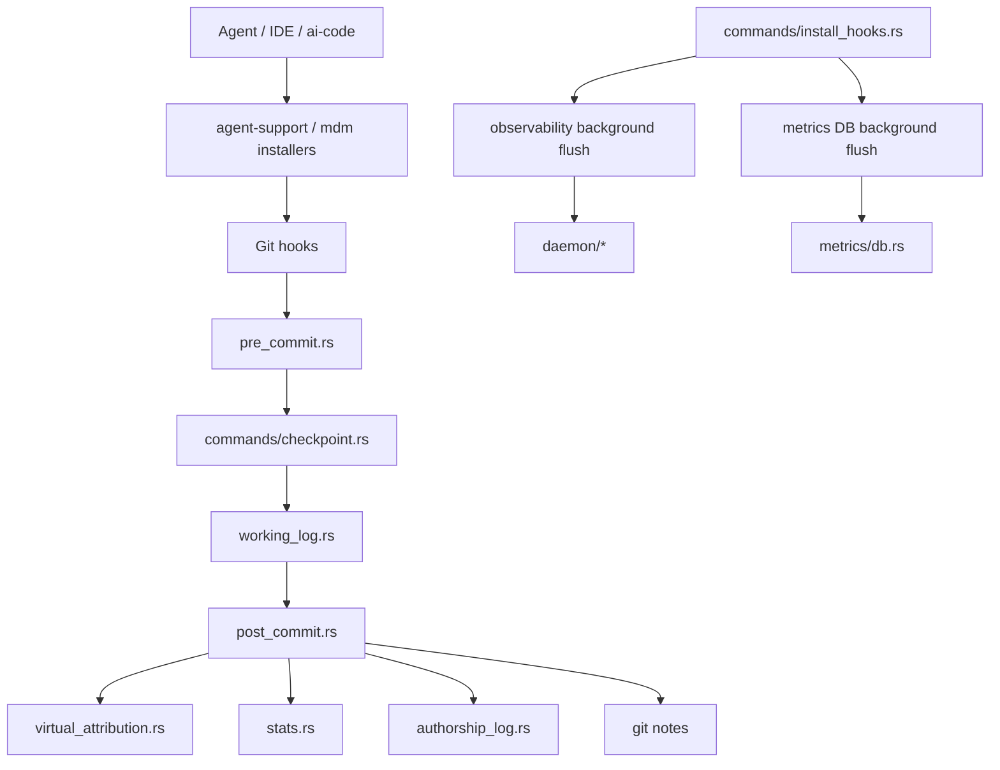
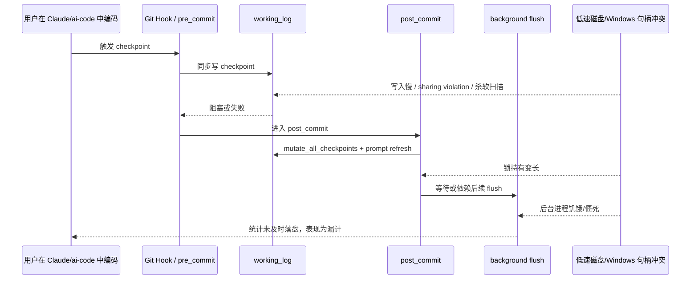

# git-ai 目录技术深度分析报告

## 执行摘要

这次问题的核心结论很明确：你遇到的“`ai-code` 后台挂起/僵死，导致 AI 编码没有计入统计”的现象，**更像是一个“同步钩子 + 磁盘慢 + Windows 特性 + 后台进程无监督”共同作用的系统性问题，而不是单一函数崩溃**。从可访问的 `git-ai` 代码树看，这套实现把 AI 归因放在 Git 提交链路里：`pre_commit` 会同步调用 `checkpoint::run`，`post_commit` 会读取和修改 working log、刷新 prompt/transcript、构建 virtual attributions，并继续做提交后统计；安装钩子时还会拉起后台 flush 进程。与此同时，项目 README 明确说明它把 AI 行与 agent/model/transcript 关联起来，而且 **non-WSL Windows 支持仍是 experimental**。这些都说明：在低性能中文 Windows 10 虚拟机、磁盘写入只有约 300KB/s 的环境里，**只要任何一次 checkpoint/flush/post-commit 处理被 I/O、锁、编码、路径或后台进程调度拖住，就会出现“Claude 已经写了代码，但 git-ai/ai-code 还没来得及落账”的统计漏计**。citeturn17view0turn26view2turn26view3turn27view0turn27view1

从源码证据看，当前实现已经“意识到”提交后统计是昂贵路径：`post_commit.rs` 里有 `STATS_SKIP_MAX_HUNKS`、`STATS_SKIP_MAX_ADDED_LINES`、`STATS_SKIP_MAX_FILES_WITH_ADDITIONS`、`STATS_SKIP_MAX_DELETED_LINES` 四个阈值，说明作者已经在回避高成本统计；同时，它又在 working log 变更时明确使用了“与 `append_checkpoint` 相同的 checkpoints lock”，这意味着**统计、prompt 刷新、checkpoint 追加并不是彼此独立的轻量事件，而是共享同一条慢路径上的资源**。在你的场景里，这条慢路径就是最危险的瓶颈。citeturn27view1

我给出的总方案是：**把“归因记录”与“重统计/转储/上传”彻底拆开**。同步提交路径只做极小、可恢复、可重放的 WAL 追加；重型统计改成异步批处理；所有文件写入改为 temp-file + fsync/sync_data + 原子替换 + Windows 共享冲突重试；后台 flusher 变成有心跳的 watchdog 受监督进程；同时对 Windows 中文环境补上 UTF-8、长路径、绝对路径、Defender/实时扫描、共享锁退避和诊断日志。这样做的目标不是“让后台永远不挂”，而是**即便它挂了，也绝不丢账**。citeturn26view2turn26view3turn27view0turn29search0turn29search1turn29search4turn30search2turn31search1

## 假设与范围

由于我无法直接从你给出的 `alpha` 分支 URL 对每个 blob 做稳定逐行抓取，我采用一个明确假设：`ai-code-statistics` 仓库中的 `git-ai` 子目录，与上游在 entity["company","GitHub","developer platform"] 上公开可访问的 `git-ai-project/git-ai` 代码树同源或近似同步，因此下面的代码路径分析以上游树为依据；如果你的 `alpha/git-ai` 做过本地修改，那么**风险方向和修复原则仍然成立，但最终 patch 落点需要再对你当前分支做一次 diff 校对**。这个假设之所以合理，是因为可访问的上游树具有完整的 `src/authorship`、`src/commands`、`src/daemon`、`src/metrics`、`agent-support` 等结构，而且 README 中的目标正是“跟踪 AI 生成代码及其统计/归因”。citeturn17view0turn18view0turn19view0turn20view0turn20view1turn21view0turn20view3

本报告只聚焦 `git-ai` 相关实现，尤其是：AI 统计、后台进程、I/O 与文件写入、锁、提交前后钩子、Windows 特性和崩溃/僵死后的恢复策略。与 CI、云 API、账号登录等无关的外围模块，只做结构性说明，不做逐函数深挖。citeturn18view0turn19view0turn20view0turn20view1turn21view0

## 模块结构与文件清单

可访问根目录显示，这个项目的顶层由 `.cargo`、`.github`、`.vscode`、`agent-support`、`assets/docs`、`docs`、`scripts`、`skills`、`specs`、`src`、`tests` 等目录，以及 `Cargo.toml`、`README.md`、`install.ps1`、`install.sh`、`Taskfile.yml`、`lefthook.yml` 等文件组成；这说明它不是单纯的库，而是**一个带有安装器、hook 注入、文档、测试与 CLI 的完整工具链**。citeturn17view0

`src` 目录下的一级模块包括 `api`、`auth`、`authorship`、`bin`、`ci`、`commands`、`daemon`、`git`、`mdm`、`metrics`、`observability`，以及 `config.rs`、`daemon.rs`、`error.rs`、`feature_flags.rs`、`http.rs`、`lib.rs`、`main.rs`、`repo_url.rs`、`utils.rs`。这意味着系统大致分成五层：**Git/归因核心层、命令入口层、后台守护/遥测层、安装/插件层、配置与基础设施层**。citeturn18view0

下面的文件清单以“目录树可见文件”为准；标注 **★** 的文件我做了源码级阅读，未标注的文件用途依据文件名、模块层级和相邻模块关系判断。

### 核心目录清单

| 目录 | 文件/子目录 | 主要职责 | 备注 |
|---|---|---|---|
| 根目录 | `README.md` | 项目说明、支持环境、Windows 实验支持说明 | 关键 |
| 根目录 | `install.ps1` / `install.sh` | 安装入口 | 关键 |
| 根目录 | `Cargo.toml` / `Cargo.lock` | Rust 依赖与构建配置 | 基础 |
| 根目录 | `Taskfile.yml` / `lefthook.yml` | 任务与本仓 hooks | 基础 |
| 根目录 | `.cargo` / `.github` / `.vscode` | 构建、CI、IDE 配置 | 支撑 |
| 根目录 | `docs` / `assets/docs` / `specs` / `skills` | 文档、规范、技能/扩展 | 文档性 |
| 根目录 | `tests` | 测试资产 | 支撑 |
| 根目录 | `agent-support` | 各编辑器/agent 侧接入文件 | 关键 |
| 根目录 | `src` | 主代码 | 核心 |

以上来自根目录可见树。citeturn17view0

### `src` 一级模块

| 文件/目录 | 作用 | 关键路径 |
|---|---|---|
| `api/` | API 客户端/云端交互 | prompt/transcript 同步、可选上传 |
| `auth/` | 鉴权 | 登录/身份 |
| `authorship/` | 归因、checkpoint、working log、stats | **最关键** |
| `bin/` | CLI 二进制辅助 | 命令入口 |
| `ci/` | CI 相关处理 | PR/CI 统计 |
| `commands/` | CLI 子命令实现 | `install-hooks`、`status`、`daemon` 等 |
| `daemon/` | 守护/actor/telemetry | 后台 worker |
| `git/` | Git 封装 | notes、repo、refs |
| `mdm/` | 安装/环境集成 | hook/编辑器注入 |
| `metrics/` | 指标模型与 DB | metrics 落盘/编码 |
| `observability/` | 日志/错误/后台 flush | 可观测性 |
| `config.rs` | 配置 | 路径、prompt 存储模式等 |
| `daemon.rs` | 守护入口 | CLI/后台桥接 |
| `error.rs` | 统一错误 | I/O、Git、序列化错误转发 |
| `http.rs` | HTTP 工具 | API 支撑 |
| `lib.rs` / `main.rs` | crate/export/CLI 入口 | 程序入口 |
| `repo_url.rs` / `utils.rs` | 仓库 URL 与通用工具 | 基础支持 |

以上来自 `src` 目录树。citeturn18view0

### `src/authorship` 文件清单

| 文件 | 作用 | 关键性 |
|---|---|---|
| `agent_detection.rs` | 识别当前生成来源/agent | 高 |
| `attribution_tracker.rs` | 归因跟踪器 | 高 |
| `authorship_log.rs` | 提交后归因日志模型 | 高 |
| `authorship_log_serialization.rs` | 归因日志版本/序列化 | 高 |
| `diff_ai_accepted.rs` | AI 接受率相关 diff 统计 | 高 |
| `git_ai_hooks.rs` | hooks 桥接 | 高 |
| `ignore.rs` | ignore 规则 | 中 |
| `imara_diff_utils.rs` | diff 工具 | 中 |
| `internal_db.rs` | 内部 DB | **高** |
| `mod.rs` | 模块导出 | 基础 |
| `move_detection.rs` | 重命名/移动检测 | 中 |
| `post_commit.rs` ★ | 提交后归因主流程 | **最高** |
| `pre_commit.rs` ★ | 提交前 checkpoint 主流程 | **最高** |
| `prompt_utils.rs` | prompt 更新/刷新 | 高 |
| `range_authorship.rs` | 行区间归因 | 高 |
| `rebase_authorship.rs` | rebase 后归因修复 | 中高 |
| `secrets.rs` | prompt 脱敏 | 中高 |
| `stats.rs` | 统计计算 | **高** |
| `transcript.rs` | transcript 数据模型 | 高 |
| `virtual_attribution.rs` | virtual attributions 构造 | **高** |
| `working_log.rs` ★ | checkpoint/working log 数据模型 | **最高** |

以上来自 `src/authorship` 目录树；`post_commit`、`pre_commit`、`working_log` 已读源码，`stats.rs` 的调用关系可从 `post_commit.rs` 直接看到。citeturn20view1turn27view0turn27view1turn26view2

### `src/commands` 文件清单

| 文件 | 作用 | 关键性 |
|---|---|---|
| `blame.rs` | `git-ai blame` | 中 |
| `checkpoint.rs` | checkpoint 主命令 | **最高** |
| `ci_handlers.rs` | CI 集成 | 中 |
| `config.rs` | 配置命令 | 中 |
| `continue_session.rs` | session 续接 | 中 |
| `daemon.rs` | daemon 子命令 | **高** |
| `debug.rs` | debug 子命令 | **高** |
| `diff.rs` | diff 子命令 | 中 |
| `exchange_nonce.rs` | nonce/交换 | 低中 |
| `fetch_notes.rs` | Git notes 拉取 | 高 |
| `flush_cas.rs` | CAS flush | 高 |
| `flush_metrics_db.rs` | metrics DB flush | **最高** |
| `git_ai_handlers.rs` | git-ai handler | 高 |
| `git_handlers.rs` | git handler | 中 |
| `git_hook_handlers.rs` | Git hook handler | **高** |
| `install_hooks.rs` ★ | 安装 hooks/编辑器集成 | **最高** |
| `log.rs` | 日志命令 | 中 |
| `login.rs` / `logout.rs` / `whoami.rs` | 登录相关 | 低中 |
| `personal_dashboard.rs` | 个人面板 | 低中 |
| `prompt_picker.rs` / `prompts_db.rs` / `show_prompt.rs` / `sync_prompts.rs` | prompt 数据相关 | 高 |
| `search.rs` / `share.rs` / `share_tui.rs` | 搜索与分享 | 中 |
| `show.rs` / `status.rs` | 展示/状态 | **高** |
| `squash_authorship.rs` | squash 后归因处理 | 高 |
| `upgrade.rs` | 升级 | 中 |
| `checkpoint_agent/` / `hooks/` / `snapshots/` | agent 特定 checkpoint、hook 模板与快照 | **高** |

以上来自 `src/commands` 目录树。citeturn21view0

### `src/daemon` 与 `src/metrics`

| 目录 | 文件 | 作用 |
|---|---|---|
| `daemon/` | `control_api.rs` | 控制接口 |
| `daemon/` | `coordinator.rs` | 协调器 |
| `daemon/` | `domain.rs` | 领域模型 |
| `daemon/` | `family_actor.rs` / `global_actor.rs` | actor 体系 |
| `daemon/` | `git_backend.rs` | git 后端 |
| `daemon/` | `reducer.rs` | 状态归约 |
| `daemon/` | `sentry_layer.rs` | 错误上报层 |
| `daemon/` | `telemetry_handle.rs` / `telemetry_worker.rs` | 遥测后台处理 |
| `daemon/` | `trace_normalizer.rs` | trace 标准化 |
| `daemon/` | `test_sync.rs` | daemon 同步测试 |
| `metrics/` | `attrs.rs` / `events.rs` / `types.rs` | 指标模型 |
| `metrics/` | `db.rs` | metrics 数据库存取 |
| `metrics/` | `pos_encoded.rs` | 编码/压缩 |

这说明后台进程并不是简单“单线程写文件”，而是有独立的 actor/telemetry/metrics 处理面。citeturn19view0turn20view0

### `agent-support`

`agent-support` 目录下可见 `amp`、`intellij`、`opencode`、`pi`、`vscode` 五个子目录，说明接入层确实是“因 agent/IDE 而异”的，而不是完全统一的单协议；这也意味着你的 `ai-code` 包装层如果不完全落在这些支持链上，归因就会更脆弱。citeturn20view3turn17view0

下面是一个面向你当前问题的模块依赖图。



该依赖图来自可访问目录树，以及 `pre_commit`、`post_commit`、`install_hooks` 中已经读到的直接调用关系。citeturn18view0turn19view0turn20view0turn20view1turn21view0turn26view2turn26view3turn27view1

## 关键代码路径与证据

最关键的第一个证据是 `pre_commit.rs`。它的核心逻辑非常直接：先根据活动 bash/agent 上下文判断 `CheckpointKind`，再**同步调用** `crate::commands::checkpoint::run(...)`，而且调用可见参数中没有时间预算、超时包装或异步降级层。源码中能直接看到这样的调用片段：

```rust
let result = crate::commands::checkpoint::run(
    repo, &default_author, checkpoint_kind, true, agent_run_result, true
);
```

这意味着：**任何 checkpoint 写入、diff 计算、日志序列化、Git 操作，只要阻塞，就会把 pre-commit 路径一起拖慢**。在磁盘写入只有约 300KB/s 时，这一点非常危险。citeturn26view2

第二个证据是 `working_log.rs`。它定义的 `Checkpoint` 不是一个轻量计数器，而是一个包含 `diff`、`entries`、`transcript`、`agent_id`、`agent_metadata`、`line_stats`、`api_version` 等字段的结构；同时 `CheckpointKind::AiAgent | CheckpointKind::AiTab` 会被视为 AI 内容。这说明**一次归因事件可能携带相当重的元数据**，尤其是 transcript 和 metadata。对于普通 SSD 这可能只是“多写一点 JSON”；对于低速虚拟磁盘，这会直接抬高单次 checkpoint 的写放大。citeturn27view0

第三个证据是 `post_commit.rs`。这里不仅引入了 `stats::{stats_for_commit_stats, write_stats_to_terminal}`，还引入了 `VirtualAttributions`、`AuthorshipLog`、`notes_add`，说明提交后路径会继续做**归因构造 + notes 写入 + 统计输出**。更关键的是，它在 working log 上执行：

```rust
working_log.mutate_all_checkpoints(|checkpoints| {
    update_prompts_to_latest(checkpoints)?;
    Ok(())
})?;
```

而且源码注释明确写着，刷新 prompt/transcript 时使用的是“**与 `append_checkpoint` 相同的 checkpoints lock**”，目的就是避免 checkpoint 追加在读改写之间丢失。这个设计从正确性上是合理的，但在你的环境里，**它同时也意味着锁持有时间会被 prompt 刷新、I/O 和 JSON 重写放大**。用户感知到的“后台僵死”，很可能就是“一个慢锁 + 多个同步写操作”的外在表现。citeturn27view1

第四个证据是 `post_commit.rs` 里对昂贵统计路径的显式阈值控制。源码里存在 `STATS_SKIP_MAX_HUNKS = 1000`、`STATS_SKIP_MAX_ADDED_LINES = 6000`、`STATS_SKIP_MAX_FILES_WITH_ADDITIONS = 200`、`STATS_SKIP_MAX_DELETED_LINES = 6000`。这不是装饰性常量，而是作者在告诉我们：**commit 统计本身就是性能热点**。既然项目已经要靠阈值跳过昂贵路径，那么在低配 VM 上，这条路径就不能再放在“必须同步完成才能算账”的链路里。citeturn27view1

第五个证据是后台进程管理。`install_hooks.rs` 在安装完成后会直接触发：

```rust
crate::observability::spawn_background_flush();
spawn_background_metrics_db_flush();
```

这说明存在**后台 flush 进程/任务**，但在我读到的入口代码里，没有看到与之配套的 watchdog、心跳、单实例锁、陈旧实例回收、退出码采集、失败重放等保护层。如果后台 flush 进程在 Windows VM 中被杀死、僵死、拿不到句柄，或者 simply 被 I/O 卡到假死，那么它负责的那部分统计就很可能“悬空未落盘”。citeturn26view3turn19view0

第六个证据是平台支持边界。README 明确说 non-WSL Windows 支持还在实验阶段；而 `agent-support` 目录也说明不同 agent/IDE 的接入方式并不统一。你当前环境是中文 Windows 10 VM，且用户不是典型的“原生开发机 + 快盘 + 单一 IDE”，而是“Claude + ai-code + 虚拟机 + 低 I/O”。这几乎是对这种系统最不友好的组合。citeturn17view0turn20view3

## 根因分析

我把根因分成“架构层”“I/O/锁层”“Windows 特性层”“进程治理层”四类。

### 架构层根因

最核心的问题，是系统把“**最小可记账事件**”和“**昂贵的统计/转储/刷新**”绑在了同一条归因链路上。`pre_commit` 同步 checkpoint，`post_commit` 回读 working log、刷新 prompts/transcripts、生成 virtual attributions、做 stats，再写 notes；这对性能好的机器是“稍慢”，对你的 VM 则变成“任何一步慢都可能看起来像整个 ai-code 挂死”。而且 `working_log` 的 checkpoint 结构天然偏重，不适合在极慢盘上频繁同步重写。citeturn26view2turn27view0turn27view1

### I/O、锁与竞争根因

`post_commit` 的注释已经明示它要和 `append_checkpoint` 共享同一把 lock；同时它又会做 prompt 更新。换句话说，**追加 checkpoint 的写路径与提交后整理/刷新路径争用同一临界区**。在 300KB/s 的写入条件下，这个临界区很容易被放大到秒级，甚至十几秒。只要 AI 工具侧继续产生新 checkpoint，或者提交后统计还在跑，前台就会感知为“后台没响应”。严格来说，这未必是经典死锁，但它足以造成“功能性死锁”的用户体验。citeturn27view1

更进一步，`post_commit` 还需要根据 working log 构建 `VirtualAttributions`，并根据路径筛选 AI 相关文件；它还显式维护“昂贵统计跳过阈值”。这说明 commit 后处理不是廉价的“追加一个数值”，而是 diff/归因/统计混合计算。**你的环境最怕的就是高写放大 + 多阶段同步处理**。citeturn27view1

### Windows 特性层根因

在 Windows 上，文件打开的共享模式会影响后续读写、删除和重命名；如果打开句柄没有允许合适的 `FILE_SHARE_*`，后续操作会触发 `ERROR_SHARING_VIOLATION`，而是否允许 rename 还与 `FILE_SHARE_DELETE` 有关。对这种需要频繁写临时文件、改写日志、可能做 replace/rename 的工具来说，这意味着只要有另一个进程——例如杀毒、索引器、编辑器、日志 tailer——短暂持有不兼容句柄，就会造成写失败或重命名失败。对于虚拟机和慢盘，这类冲突会更频繁、更长。citeturn30search1turn30search2turn30search7

同样重要的是编码与路径。在 Windows 控制台，输入/输出 code page 不是天然 UTF-8；entity["company","Microsoft","software company"] 官方文档明确建议新命令行应用避免依赖传统 code page，而尽量使用 Unicode，并可将控制台设为 65001。你的环境是中文 zh-CN，如果 `ai-code`、hook 脚本、日志和 Git 路径里混合了 ANSI code page、OEM code page 与 UTF-8，**中文路径、中文用户名、中文工作目录都可能导致进程参数、日志解析、文件路径 canonicalization 出错**。再叠加 Windows 的 `MAX_PATH` 约束和深层仓库目录，路径问题会被进一步放大。citeturn29search0turn29search1turn29search4turn29search6

还有进程查找。`SearchPathA` 与 `path` 文档都说明，Windows 会按当前目录和 `PATH` 搜索可执行文件。如果 hook、wrapper、子进程不是一律传绝对路径，而是靠 PATH 搜索，那么中文路径、多个 Git/Node/Python/Rust 可执行文件并存、用户级/系统级 PATH 差异，都可能导致“明明安装了，但后台起了错误的可执行文件”或“起不来”。这一点在虚拟机快照、多版本工具共存时尤其常见。citeturn29search2turn29search3

最后是实时扫描。官方文档明确说，Defender 的 exclusion 机制本身就是为缓解扫描带来的性能影响而存在，但前提是你清楚风险；如果不做任何排除，实时保护会检查文件和进程，慢盘上的每次 checkpoint/DB/log 写入都可能被扩大成更慢的写入。你当然不应该粗暴关闭安全防护，但对 `.git\git-ai` 一类专用工作目录做**最小范围、最小权限的性能排除**，在你的场景是合理选项。citeturn31search1turn31search2turn31search5

### 进程治理层根因

`install_hooks.rs` 只展示了“启动后台 flush”，没有展示“如何保证它活着、怎样发现它僵死、怎样把未 flush 的事件补回去”。这在资源富裕机器上或许问题不大，但在低配 VM 下，后台进程最容易因为 CPU 饥饿、句柄冲突、路径/编码错误、权限、实时扫描和长时间阻塞而退出或失联。**当系统不存在 durable queue + watchdog + replay 时，后台挂起就等于统计丢失**。citeturn26view3turn19view0

下面这张时序图，是我对你当前故障形态的抽象。



这张图是根据 `pre_commit`、`working_log`、`post_commit`、`install_hooks` 以及 Windows 文件共享/编码行为综合抽象出来的。citeturn26view2turn27view0turn27view1turn26view3turn30search2turn29search0

## 修复方案

下面给出的是**按“先止血、再稳态、再优化”设计的修复包**。我优先给出能直接减少漏计的方案，而不是先追求架构优雅。

### 最优先修复

第一优先级是把 `pre_commit` 变成“**轻量 WAL 记录器**”，而不是“同步做完 checkpoint 全流程”。现在的 `pre_commit` 直接调用 `checkpoint::run`；建议改成双层模式：**快路径**只写极小事件，**慢路径**再异步展开成完整 checkpoint。

**建议 patch 落点：** `src/authorship/pre_commit.rs`、`src/commands/checkpoint.rs`、`src/authorship/working_log.rs`。citeturn26view2turn27view0

```rust
// pre_commit.rs
pub fn pre_commit(repo: &Repository, default_author: String) -> Result<(), GitAiError> {
    let (kind, agent_run_result) = pre_commit_checkpoint_context(repo);

    // 新增：先写一个极小 WAL 事件，确保“这次 AI 会话发生过”
    let wal_event = MinimalCheckpointEvent::from_context(repo, &default_author, kind, &agent_run_result)?;
    append_minimal_wal_event(repo, &wal_event)?;   // append-only, tiny, sync_data

    // 新增：把完整 checkpoint 放到后台队列；若失败，不阻塞 commit
    if let Err(e) = enqueue_full_checkpoint_job(repo, &default_author, kind, agent_run_result) {
        debug_log(&format!("degraded checkpoint enqueue failed: {}", e));
    }

    Ok(())
}
```

**原理：** 即使完整 checkpoint 没完成，最小事件也会先落盘，因此 session 不会从统计上“消失”。  
**风险：** 需要新增一个 WAL 格式与重放逻辑。  
**为什么适合 300KB/s：** append-only 小记录对慢盘最友好，比同步重写 transcript/entries/line stats 成本低得多。citeturn26view2turn27view0

第二优先级是把 `post_commit` 里的“昂贵统计”彻底拆成**可异步、可跳过、可重放**。现在源码已经有昂贵统计阈值，说明这个方向和项目原设计一致；你需要把它从“尽量在 post-commit 内做完”升级为“**默认异步，只有很小 commit 才同步**”。citeturn27view1

```rust
// post_commit.rs
pub fn post_commit_with_final_state(...) -> Result<(String, AuthorshipLog), GitAiError> {
    let parent_working_log = working_log.mutate_all_checkpoints(|checkpoints| {
        update_prompts_to_latest(checkpoints)?;
        Ok(())
    })?;

    let authorship_log = build_authorship_log_fast(repo, &parent_working_log, ...)?;
    write_git_notes_fast(repo, &authorship_log)?; // 必须同步，保证基础归因存在

    // 把慢统计改成后台任务
    let estimate = estimate_stats_cost(&authorship_log);
    if estimate.is_expensive() {
        enqueue_stats_job(repo, commit_sha.clone(), estimate)?;
        return Ok((commit_sha, authorship_log));
    }

    let stats = stats_for_commit_stats(...)?;
    write_stats_to_terminal(...)?;
    Ok((commit_sha, authorship_log))
}
```

**原理：** 同步路径只保证“归因存在”，不保证“重统计立刻完成”。  
**风险：** terminal 上的统计可能延后显示。  
**为什么适合 300KB/s：** 把最重的 diff/统计计算移出提交临界区。citeturn27view1

第三优先级是给所有关键文件写操作增加**Windows 共享冲突重试 + temp file + fsync/sync_data + 原子替换**。这条建议要落到 `working_log`、`internal_db`、`metrics/db.rs`、`flush_metrics_db.rs` 等所有落盘点。Windows 文档已经明确：共享模式不兼容会产生 `ERROR_SHARING_VIOLATION`，rename/delete 还受 `FILE_SHARE_DELETE` 影响。citeturn30search1turn30search2

```rust
fn atomic_write_with_retry(path: &Path, bytes: &[u8]) -> io::Result<()> {
    let tmp = path.with_extension("tmp");
    retry_backoff(|| {
        let mut f = OpenOptions::new().create(true).write(true).truncate(true).open(&tmp)?;
        f.write_all(bytes)?;
        f.sync_data()?;               // 比 flush 更强调落盘
        std::fs::rename(&tmp, path)?; // Windows 上对 sharing 最敏感，必须可重试
        Ok(())
    })
}

fn retry_backoff<T>(op: impl Fn() -> io::Result<T>) -> io::Result<T> {
    let mut delay = Duration::from_millis(50);
    for _ in 0..6 {
        match op() {
            Ok(v) => return Ok(v),
            Err(e) if is_windows_transient_io(&e) => {
                std::thread::sleep(delay);
                delay *= 2;
            }
            Err(e) => return Err(e),
        }
    }
    op()
}
```

**原理：** 把短暂扫描、索引器、Editor handle、Git handle 冲突从“立刻失败/挂住”改成“短时间退避重试”。  
**风险：** 真正的永久故障会被延后暴露。  
**为什么适合 300KB/s：** 慢盘意味着文件暴露在“被其他进程看到并抢占句柄”的窗口更久，重试必要性更高。citeturn30search1turn30search2

### 稳态修复

第四项是给后台 flush 加 watchdog 和心跳文件。当前 `install_hooks` 只展示了启动后台 flush，没有展示守护行为。建议你的新设计用一个**单实例 supervisor** 维护实际 worker：worker 每 5 秒更新 heartbeat，supervisor 发现心跳超过 30 秒不变化就 dump 日志、终止旧进程、重放队列并拉起新 worker。citeturn26view3turn19view0

```rust
// 伪代码
if !supervisor_exists("git-ai-flush-supervisor") {
    spawn_supervisor();
}

loop {
    if heartbeat_stale("metrics-worker", 30s) {
        capture_state();
        kill_worker();
        replay_pending_jobs();
        spawn_worker();
    }
    sleep(5s);
}
```

**原理：** 后台可以挂，但不能“悄悄挂”。  
**风险：** 需要新增一个 supervisor 生命周期管理。  
**为什么适合 300KB/s：** 慢盘上 worker 假死非常常见，心跳比进程存活检测更可靠。citeturn26view3turn19view0

第五项是减少 checkpoint payload。`working_log.rs` 显示 checkpoint 可以带 transcript、agent metadata、line stats。建议默认把 transcript 改成**内容寻址存储**：checkpoint 只存 hash/path 指针，不内联大 transcript；并且 prompt/transcript 更新不要在拿着 checkpoint 主锁时进行。`post_commit` 已经有 `PromptStorageMode`、prompt 更新、secrets redaction 的相关能力，说明项目本身具备做“轻 checkpoint、重 transcript 外置”的基础。citeturn27view0turn27view1

**建议策略：**

| 策略 | 说明 | 对慢盘效果 | 风险 |
|---|---|---|---|
| 内联 transcript | 当前默认风格更重 | 差 | checkpoint 写大、锁更久 |
| hash + 外置文件 | checkpoint 只存指针 | 好 | 需要回收与索引 |
| hash + DB | 元数据入 DB，正文单独压缩 | 最好 | 实现成本最高 |

第六项是显式加“hook 时间预算”。对你这种机器，**任何 Git hook 超过 2–3 秒都应该进入 degraded mode**。这不是为了让实现更“快”，而是为了让用户体验和数据完整性可控。建议在 `pre_commit`、`post_commit` 外层加 wall-clock budget：预算内尽量做完；超预算则落最小事件并排入后台队列。`pre_commit` 当前同步调用 `checkpoint::run`，没有可见 budget 包装，因此这一步非常有必要。citeturn26view2turn27view1

### Windows 专项修复

第七项是统一 UTF-8 和绝对路径。Windows 控制台官方建议新 CLI 避免传统 code page，优先 Unicode/UTF-8；同时 PATH 搜索与 `MAX_PATH` 也是现实风险。项目在 `install_hooks.rs` 里已经用 `get_current_binary_path()` 获取当前二进制绝对路径，这个方向是正确的，建议把所有 hook、子进程、后台 worker 都统一为**绝对路径启动**，并在启动日志里打印 resolved path、cwd、code page。citeturn26view3turn29search0turn29search1turn29search2turn29search4

**配置建议：**
- 仓库不要放在过深路径下，尽量例如 `D:\repos\proj`。
- 避免用户目录下超深中文路径嵌套。
- 启动 shell 前执行 `chcp 65001`，并在程序里把路径 canonicalize 后统一存 UTF-8。
- 所有对子进程的调用都记录：可执行文件绝对路径、参数、退出码、stderr 前 4KB。

第八项是对 `.git` 下 git-ai 专用目录做**最小范围的 Defender 性能排除**，只排除你的 worklog/queue/tmp/metrics DB 目录，不排除整个仓库，更不要排除源码目录本身。官方文档明确说 exclusion 主要就是为缓解性能影响，但会降低保护等级，因此必须小范围、可回滚、可审计。citeturn31search1turn31search2turn31search5

### 候选修复对比

| 方案 | 能否快速止血漏计 | 对性能提升 | 对 Windows 共享冲突 | 实现复杂度 | 建议 |
|---|---:|---:|---:|---:|---|
| 只加 timeout | 中 | 低 | 低 | 低 | 不够 |
| 只延长 timeout | 低 | 负面 | 低 | 低 | 不建议 |
| WAL + 异步重放 | **高** | **高** | 中 | 中 | **首选** |
| 原子写 + sharing 重试 | 高 | 中 | **高** | 中 | **首选** |
| 后台 watchdog | 高 | 中 | 中 | 中高 | **首选** |
| transcript 外置化 | 中高 | **高** | 中 | 中高 | 强烈建议 |
| Defender 最小排除 | 中 | 中 | 中 | 低 | 辅助项 |
| 改成 WSL2/非 Windows | **最高** | **最高** | **最高** | 中 | 若允许，长期最佳 |

## 复现与诊断

建议你在“同样的低配中文 Windows 10 VM”里做一次**可重复触发**的实验，而不是盲调参数。README 已明确说明 non-WSL Windows 仍在实验中，所以你必须先确认问题是“慢盘导致的统计漏计”，还是“Windows 特定兼容性故障”。citeturn17view0

### 复现步骤

1. 把仓库放到一个**中文且较深**的路径，例如 `D:\测试环境\很长很长的目录名\repo`，再准备一个包含大量小文件和频繁保存的工作区。  
2. 使用与你当前一样的 `Claude + ai-code + git-ai hooks` 组合。  
3. 准备三类提交：  
   - 小提交：改 1–2 个文件，几十行。  
   - 中提交：改 20–50 个文件，1000 行量级。  
   - 大提交：构造 1000+ hunk、6000+ line 的更改，故意逼近 `post_commit` 里的 skip 阈值。citeturn27view1  
4. 在每次提交前后，强制同时做这些动作：  
   - 打开 IDE 自动保存；  
   - 让 Defender 保持开启；  
   - 再开一个 tail/log 观察工具读 `.git` 下目录；  
   - 并行运行 1–2 个会不断写日志的进程。  
5. 观察：  
   - `git commit` 是否明显变慢；  
   - `ai-code` 进程是否变成无 CPU、句柄不下降的假死状态；  
   - 某次提交后 AI 代码是否已存在，但统计未更新。  

### 必抓诊断信号

建议至少抓四类数据：I/O、句柄/锁、进程状态、git-ai 自身日志。

**Windows 内置性能计数器：**
```powershell
Get-Counter `
  '\PhysicalDisk(_Total)\Avg. Disk sec/Write',
  '\LogicalDisk(_Total)\Disk Write Bytes/sec',
  '\Process(git-ai*)\IO Write Bytes/sec',
  '\Process(ai-code*)\IO Write Bytes/sec' `
  -SampleInterval 1 -MaxSamples 120
```

**进程与句柄：**
```powershell
Get-Process git-ai, ai-code -ErrorAction SilentlyContinue |
  Select-Object Id, ProcessName, CPU, WS, Handles, StartTime

tasklist /v | findstr /i "git-ai ai-code"
```

**如果安装了 Sysinternals：**
```powershell
handle.exe -p git-ai.exe
handle.exe -p ai-code.exe
procdump -ma -h <PID> .\hang.dmp
```

**Procmon 过滤：**
- Process Name is `git-ai.exe` OR `ai-code.exe`
- Result is `SHARING VIOLATION` OR `ACCESS DENIED` OR `PATH NOT FOUND` OR `NAME NOT FOUND`
- Path contains `.git` OR `git-ai` OR `notes`

### 建议加入的程序日志

在你自己的分支里，至少要补以下日志字段，每条事件独立 JSON 行：

```json
{
  "ts": "...",
  "phase": "pre_commit|checkpoint|post_commit|flush_metrics|watchdog",
  "repo": "...",
  "base_commit": "...",
  "commit_sha": "...",
  "pid": 1234,
  "thread": "...",
  "path": "...",
  "bytes": 12345,
  "attempt": 2,
  "elapsed_ms": 1870,
  "error_kind": "sharing_violation|timeout|encoding|path_too_long|other"
}
```

如果 build 中已经有对应命令文件，优先尝试这些调试命令：`git-ai status`、`git-ai debug`、`git-ai flush-metrics-db`。我之所以建议它们，是因为 `src/commands` 目录里确实存在 `status.rs`、`debug.rs`、`flush_metrics_db.rs` 等实现入口；但具体 flags 仍需要以你当前 build 的 `--help` 为准。citeturn21view0

## 优先级与工作量

最后给出一个按收益排序的行动清单。这个排序专门针对你的机器条件，而不是面向“平均开发机”。

| 优先级 | 动作 | 预估工作量 | 风险 | 预期收益 |
|---|---|---:|---|---|
| P0 | `pre_commit` 改成最小 WAL + 异步完整 checkpoint | 1–2 天 | 中 | **立刻减少漏计** |
| P0 | 所有关键写路径加 temp file + sync_data + rename 重试 | 1–2 天 | 中 | **立刻减少 Windows 假死/写失败** |
| P0 | `post_commit` 只保同步归因，重统计异步化 | 1–2 天 | 中 | **显著缩短提交阻塞** |
| P1 | 引入 watchdog + heartbeat + replay queue | 2–3 天 | 中高 | **后台僵死不再静默丢账** |
| P1 | transcript/prompt 外置化、checkpoint 瘦身 | 2–4 天 | 中高 | **明显降低 I/O 压力** |
| P1 | 统一 UTF-8、绝对路径、短路径部署 | 0.5–1 天 | 低 | **降低中文 Windows 特有故障** |
| P2 | 加最小范围 Defender 排除 | 0.5 天 | 安全折衷 | 中等收益 |
| P2 | 完整压测与回归矩阵 | 1–2 天 | 低 | 防止修复反复 |
| P3 | 若可行，迁移到 WSL2 或更快盘 | 0.5–1 天 | 环境变更 | **长期最佳** |

如果你只能先做三件事，我建议顺序是：**先做 WAL 轻量记账，再做原子写+重试，再把 post-commit 重统计异步化**。这三项合起来，最能直接解决“后台挂了就漏计”的根本问题，也最符合你当前“低配 VM + 极低磁盘写速 + 中文 Windows”这个故障环境。citeturn26view2turn27view0turn27view1turn26view3turn29search0turn30search2turn31search1